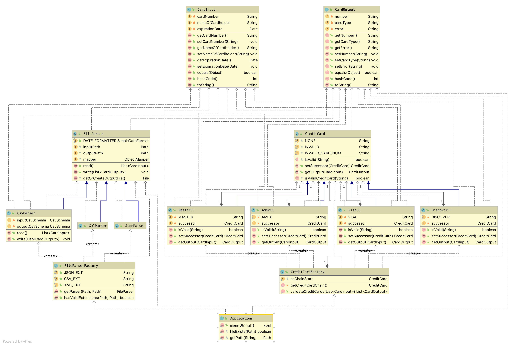
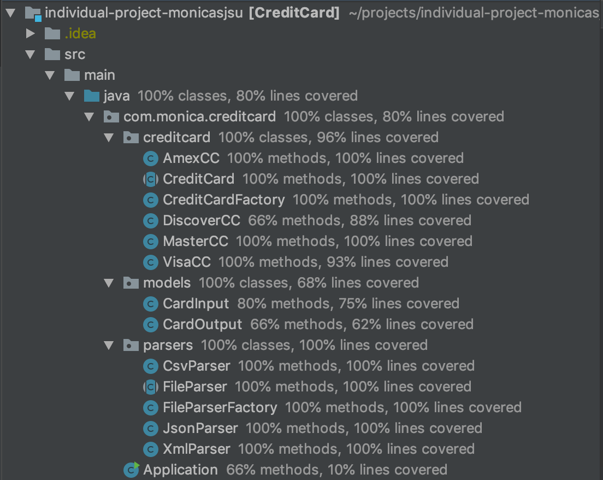

## Credit Card Detection

Given an input file containing credit card details such as card number, expiration date and name, this project detects
the type of the credit card and output the records to the file.

Acceptable input formats: `csv`, `json`, `xml`


## Design patterns
This solution primarily uses these design patterns.
#### Creational Patterns
 
- I used `Factory pattern` to create instances of different types of file parsers depending on the file extension. I also used `Factory method`
inside the `FileParserFactory.java` to create instances of the parsers depending on the extension.
  
- I have also used `Builder Pattern` to create instances of `CardInput` and `CardOutput` models.
This helped me to create ths instances for these classes with out the maintaining the fields order and to enable chaining.

- I have also used `Singleton` pattern to create the CreditCard Chain instance using early initialization.
This helps retrieving the same instance with out the need to create multiple instances of the Credit Cards.

#### Behavioral Patterns

 - `Chain of Responsibility` for validating credit cards. I am passing each record of the input file to the visa credit card instance
 which then forwards the requests to the next card, which in my case is MasterCard if the card type is not visa and so forth. 
 `CreditCardFactory.java` has the logic to create the credit cards chain in my program.
 Thus this pattern helps us to clearly confine the validation logic of each credit card type in its own class. Also this pattern
 helps to easily add additional credit card types
 
 - In general I have used `Strategy Pattern` for designing different file parsers and credit card classes. Common methods and 
 abstract methods were included in the parent abstract classes. These parent classes were inherited and the methods were
 overridden by the child classes. `FileParser` is an abstract class which was inherited by `CsvParser`, `JsonParser` and `XmlParser`.
 Similarly `CreditCard` is an abstract class which was inherited by `VisaCC`, `MasterCC`, `AmexCC` and `DiscoverCC` classes.
 I made sure that I have always written code for these abstract classes where ever needed.

## Class Diagram

##### Note:
Please refer to the `class_diagram.png` in the repository for higher resolution

## Usage
1. Clone the repository
2. cd into the project
    
    `cd individual-project-monicasjsu`
3.  Make sure you have maven installed in your machine
    
    `brew install maven` and then
    
    `mvn clean install`
    ##### Note: 
    If you don't have maven/don't want to install it, I have included the final `.jar` file inside `target` folder.

4. Run the following command
    `java -jar target/CreditCard-1.0-SNAPSHOT.jar inputPath outputPath`
    
    inputPath should be a valid absolute path or relative path of the input file.
    outputPath should be a valid  absolute path or relative path of the output file.
    ##### Note: 
    If Output path doesn't exist, a new file will be created and the output will be written.
    
    ##### Example:
    `java -jar target/CreditCard-1.0-SNAPSHOT.jar src/test/resources/Sample.json  src/test/resources/output.json`
    `java -jar target/CreditCard-1.0-SNAPSHOT.jar src/test/resources/Sample.xml  src/test/resources/output.xml`
    `java -jar target/CreditCard-1.0-SNAPSHOT.jar src/test/resources/Sample.csv  src/test/resources/output.csv`
    
    
## Libraries used
For this project, I have mainly used `jackson` libraries to read the file content from input file and to write the outputs to file.

```$xslt
        <dependency>
            <groupId>com.fasterxml.jackson.dataformat</groupId>
            <artifactId>jackson-dataformat-xml</artifactId>
            <version>2.10.3</version>
        </dependency>
        <dependency>
            <groupId>com.fasterxml.jackson.core</groupId>
            <artifactId>jackson-databind</artifactId>
            <version>2.10.3</version>
        </dependency>
        <dependency>
            <groupId>com.fasterxml.jackson.dataformat</groupId>
            <artifactId>jackson-dataformat-csv</artifactId>
            <version>2.10.3</version>
        </dependency>
```

## Testing

I have used Junit framework to write unit tests and partial integration tests. I was able to achieve
the total coverage as shown below for a total of 70 tests.

 